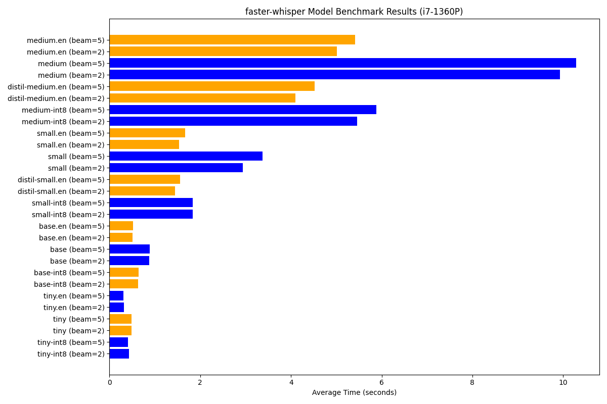
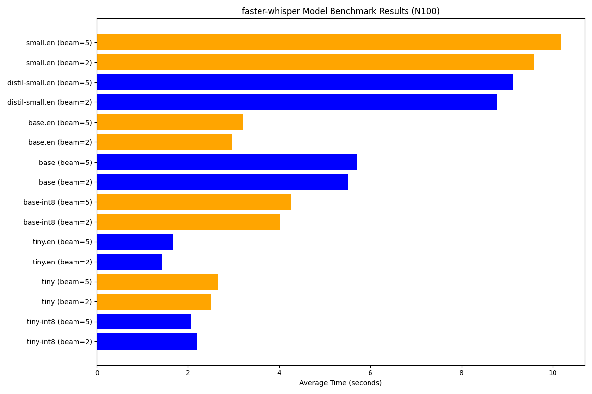
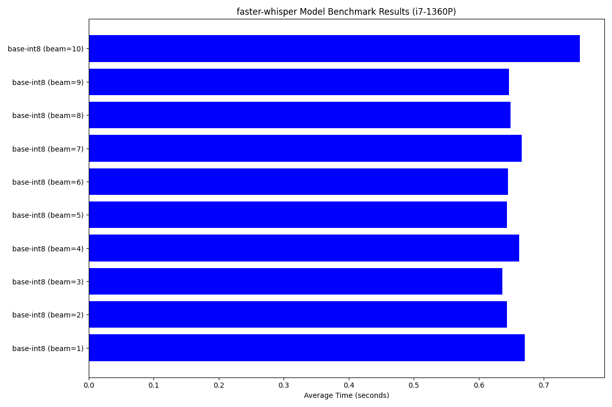

# Faster-Whisper Performance Test for Home Assistant Voice

This repository includes a test program and test results for evaluating the performance of [`faster-whisper`](https://github.com/guillaumekln/faster-whisper) in the context of [`Home Assistant Voice`](https://www.home-assistant.io/voice_control/). Note that the accuracy of speech-to-text is **out of scope**; this test focuses solely on processing time.

---

## Test Method

Six voice recordings from a Home Assistant Voice Preview Edition were captured. 
To capture voice recordings add the following to `configuration.yaml`
```
assist_pipeline:
  debug_recording_dir: /share/assist_pipeline
```

The recordings are spoken in English with a Finnish accent and include the following phrases:

1. `Turn off the lights`
2. `Set the lights to maximum brightness`
3. `What's the temperature?`
4. `What's the temperature of the heat pump?`
5. `Turn the lights to half brightness`
6. `Turn off the lights`

These recordings were processed using the whisper models available in the Home Assistant Voice pipeline, with various beam width settings. Note that the `large` and `turbo` models were too slow to be relevant for the results. The processing time for each configuration was averaged and recorded.

---

## Test Systems

### Hardware

- **System 1:** `Intel i7-1360P`
  - 16GB 4800 MT/s dual channel RAM
- **System 2:** `Intel N100`
  - 32GB 3200 MT/s single channel RAM

### Host Environment

- **Host OS:** `Proxmox`
- **Virtual Machine:** `Ubuntu Server 24.04`
  - Full allocation of CPU cores
  - CPU type: Host
  - 12GB of RAM

---

## Results

The default `base-int8` model in Home assistant is a good choice, but I will personally experiment more with the `base.en` and `small-int8` models.
The graphs only show values less than 10 seconds. See [.\results](results) for all results.

---

## Benchmark Images

### Performance Results on `Intel i7-1360P`



### Performance Results on `Intel N100`



### Benchmark Results for Beam Width



---

